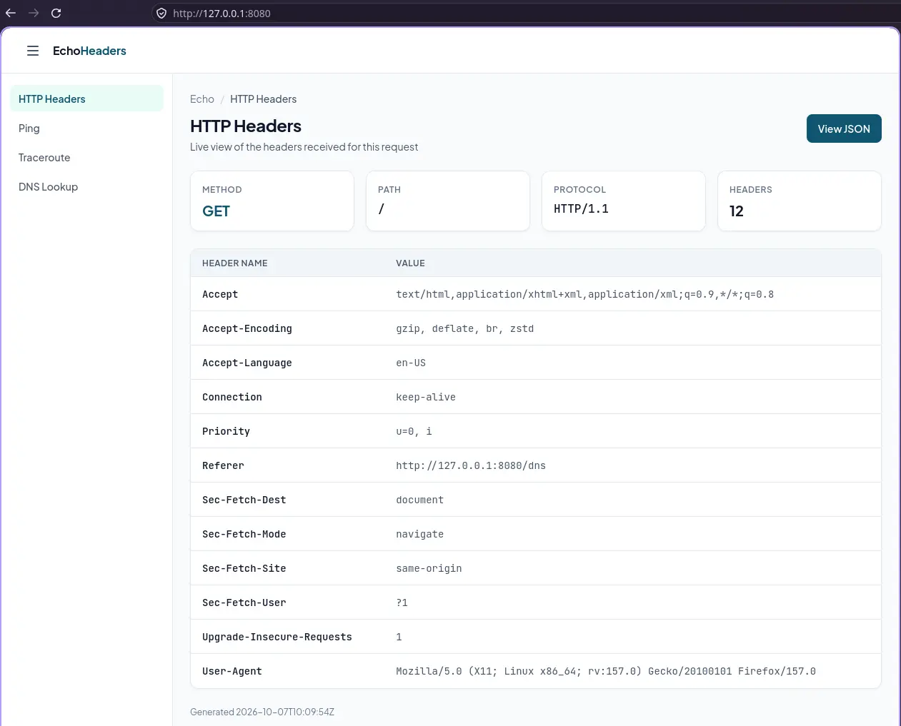
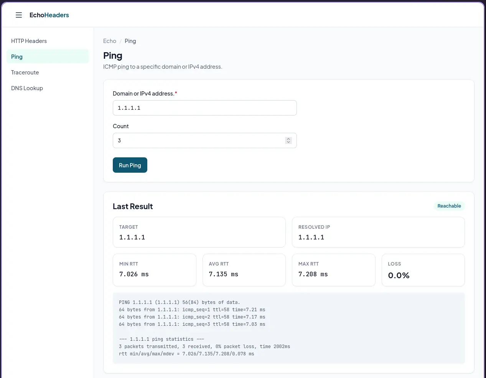
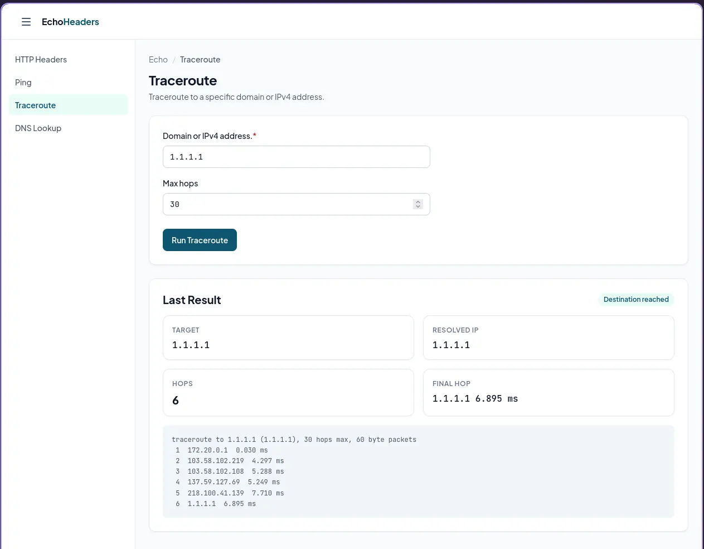
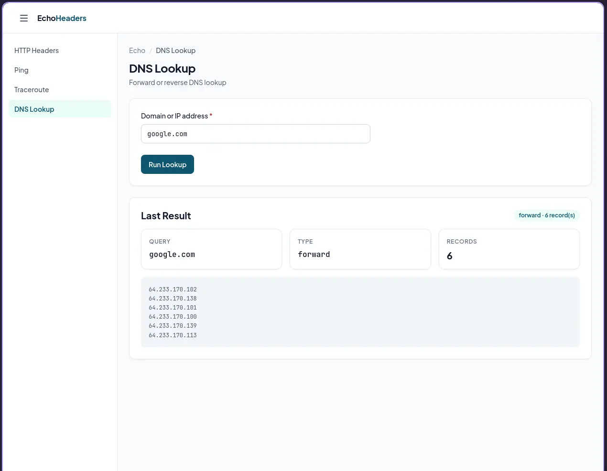

# EchoHeaders

A minimal Go HTTP service packaged as a small network console with three modules:

- **HTTP Headers** (`/`) — echoes back the request/response headers, as a styled HTML page or JSON
- **Ping** (`/ping`) — POST an IPv4/IPv6 address to run an ICMP ping from the container
- **Traceroute** (`/traceroute`) — POST an IPv4/IPv6 address to run a traceroute from the container
- **DNS Lookup** (`/dns`) — POST a domain (forward, `dig +short`) or an IP address (reverse,
  `dig +short -x`) to resolve it from the container

Plus a `/healthz` endpoint for probes. Every page renders inside a shared console shell
(topbar + left sidebar module navigation + breadcrumb, e.g. `Console / HTTP Headers`).
The sidebar is collapsible via the hamburger button in the topbar (desktop: toggle; mobile:
opens as an overlay drawer and closes on navigation).

## Features

- **Four modules** — HTTP Headers, Ping, Traceroute, DNS Lookup, each a self-contained Go
  source file
- **Two response formats** — HTML page when the client sends `Accept: text/html`, JSON otherwise
- **`?format=json` / `?format=html`** — force a specific format regardless of `Accept`
- **Safe rendering** — all user-controlled values (headers, IPs, command output) are HTML-escaped
- **Domain + IP targets** — ping/traceroute accept a domain (resolved via the system
  resolver, first IPv4 preferred) or a raw IP
- **Command safety** — all probe targets must parse as an IP (`net.ParseIP`) or match a
  strict domain allowlist; commands are executed as arguments (no shell), so there is no
  command injection
- **`/healthz`** — plain-text `ok` endpoint for readiness/liveness probes
- **Hardened container** — multi-stage build, non-root user (numeric UID), read-only root FS
  friendly, `curl`/`ping`/`traceroute`/`dig` installed in the final image
- **Operational Go server** — read/write/idle timeouts, graceful shutdown on SIGINT/SIGTERM
- **Structured logs** — every request (and lifecycle events) is logged to stdout as one JSON
  line, including `remoteAddr` and `realIp` (from `X-Forwarded-For` / `X-Real-Ip`), ready for
  `kubectl logs` / Loki / any JSON log pipeline

## Screenshots





## Endpoints

| Path             | Behavior                                                              |
| ---------------- | --------------------------------------------------------------------- |
| `GET /`          | HTTP Headers module — HTML (browser) or JSON (anything else)          |
| `GET /?format=json` | Force JSON response                                               |
| `GET /?format=html` | Force HTML response                                               |
| `GET /ping`      | Ping module page (form: `ip`, `count`)                                |
| `POST /ping`     | Run ping — form fields `ip` (required, **domain or valid IP**) + `count` (1–20, default 4) |
| `GET /traceroute`| Traceroute module page (form: `ip`, `maxhops`)                        |
| `POST /traceroute` | Run traceroute — form fields `ip` (required, **domain or valid IP**) + `maxhops` (1–60, default 30) |
| `GET /dns`       | DNS Lookup module page (form: `value`)                                |
| `POST /dns`      | Run lookup — form field `value` (required): a domain resolves forward (`dig +short`), an IP address reverse-resolves (`dig +short -x`) |
| `GET /healthz`   | `200 ok` — health check                                               |

### HTTP Headers JSON response

The body contains both the **request** (method, path, protocol, host, query, all request
headers) and the **response** (status + response headers set by the handler) for easy
debugging:

```json
{
  "request": {
    "method": "GET",
    "path": "/",
    "protocol": "HTTP/1.1",
    "host": "echoheaders:80",
    "query": {},
    "headers": {
      "Accept": ["*/*"],
      "User-Agent": ["curl/8.22.0"]
    }
  },
  "response": {
    "status": "200 OK",
    "headers": {
      "Content-Type": ["application/json"],
      "Access-Control-Allow-Origin": ["*"]
    }
  },
  "generated_at": "2026-10-07T05:37:38Z"
}
```

Note: `Date` and `Content-Length` are added by the Go HTTP server at the wire level, so they
appear in `curl -i` / browser devtools output but are not echoed inside the body.

### Ping

```bash
# HTML result page (reachability chip, min/avg/max RTT cards, raw output)
curl -H "Accept: text/html" -X POST -d 'ip=1.1.1.1&count=4' http://localhost:8080/ping

# JSON result
curl -s -X POST -d 'ip=1.1.1.1&count=4' http://localhost:8080/ping | jq
```

```json
{
  "ok": true,
  "target": "example.com",
  "resolved_ip": "172.66.147.243",
  "ip": "172.66.147.243",
  "count": 2,
  "output": "PING 172.66.147.243 (172.66.147.243) 56(84) bytes of data.\n...",
  "error": "",
  "stats": { "sent": 2, "received": 2, "loss_pct": 0, "min_ms": 6.649, "avg_ms": 6.71, "max_ms": 6.772 },
  "has_rtt": true
}
```

`target` is the raw input; `resolved_ip` is what was actually probed (identical to
`target` when an IP was given).

### Traceroute

```bash
curl -H "Accept: text/html" -X POST -d 'ip=1.1.1.1&maxhops=30' http://localhost:8080/traceroute
```

```json
{
  "ok": true,
  "target": "1.1.1.1",
  "resolved_ip": "1.1.1.1",
  "ip": "1.1.1.1",
  "max_hops": 8,
  "output": "traceroute to 1.1.1.1 (1.1.1.1), 8 hops max, 60 byte packets\n 1  172.17.0.1  0.022 ms\n ...",
  "error": "",
  "stats": { "hops": 6, "destination": "1.1.1.1  6.645 ms" },
  "has_stats": true
}
```

Domains are resolved before probing (first IPv4, else first IPv6); `ok` is true only when
the resolved IP appears as the final hop.

### DNS Lookup

The input is inspected first: a valid IP address triggers a reverse lookup
(`dig +short -x <ip>`), anything else (a domain-name-shaped string) is resolved forward
(`dig +short <domain>`).

```bash
# forward: domain -> A/AAAA records
curl -s -X POST -d 'value=example.com' http://localhost:8080/dns | jq

# reverse: IP -> PTR record
curl -s -X POST -d 'value=8.8.8.8' http://localhost:8080/dns | jq
```

```json
{
  "ok": true,
  "value": "example.com",
  "type": "forward",
  "output": "104.20.23.154\n172.66.147.243",
  "records": ["104.20.23.154", "172.66.147.243"],
  "error": ""
}
```

`ok` is `false` (chip: **No result**) when `dig` returns no records, e.g. NXDOMAIN.

All network modules run **from the container's network namespace**, so results reflect the
path/namespace of the pod/container.

### Logging (stdout, JSON lines)

Every request produces one JSON line on stdout, e.g.:

```json
{"bytes":332,"duration_ms":0.032,"level":"info","method":"GET","msg":"request","path":"/","query":"","realIp":"203.0.113.7","remoteAddr":"172.17.0.1:58602","status":200,"time":"2026-10-07T06:27:40.755Z","user_agent":"curl/8.22.0"}
```

`realIp` is taken from the first `X-Forwarded-For` value, then `X-Real-Ip`, falling back to
`remoteAddr` (the proxy's address). Lifecycle events are logged the same way:
`{"msg":"listening","port":"8080"}` at startup and `{"msg":"stopped"}` on graceful shutdown.
Errors (render/encode/server failures) are logged with `"level":"error"`.

### HTML pages

Each module renders the standard page anatomy: breadcrumb (`Console / <Module>`), page header
with a single primary action, summary metric cards, and a result/content card with
success/danger status chips and an empty state before the first run.

## Quick start (Docker)

```bash
docker build -t echoheaders .
docker run --rm -p 8080:8080 echoheaders

# HTTP Headers
curl -s http://localhost:8080/ | jq
curl -s -H "Accept: text/html" http://localhost:8080/ > out.html

# Ping
curl -s -X POST -d 'ip=1.1.1.1&count=4' http://localhost:8080/ping | jq

# Traceroute
curl -s -X POST -d 'ip=1.1.1.1&maxhops=30' http://localhost:8080/traceroute | jq

# DNS lookup (forward / reverse)
curl -s -X POST -d 'value=example.com' http://localhost:8080/dns | jq
curl -s -X POST -d 'value=8.8.8.8' http://localhost:8080/dns | jq

# Health
curl -s http://localhost:8080/healthz

# curl works inside the container too
docker run --rm echoheaders curl -sf http://127.0.0.1:8080/healthz
```

## Quick start (Docker Compose)

```bash
cd deploy/docker
docker compose up -d          # uses the prebuilt vikipranata/echoheaders:latest image
docker compose ps             # STATUS should be "healthy"
```

## Configuration

| Variable              | Default | Description                                              |
| --------------------- | ------- | -------------------------------------------------------- |
| `PORT`                | `8080`  | TCP port the server listens on                           |
| `RATE_LIMIT_DNS`      | `10`    | DNS Lookup executions per minute, per client IP          |
| `RATE_LIMIT_PING`     | `10`    | Ping executions per minute, per client IP                |
| `RATE_LIMIT_TRACEROUTE` | `10`  | Traceroute executions per minute, per client IP          |

### Rate limiting

The **execution (POST)** endpoints of the Ping, Traceroute, and DNS Lookup modules are
rate-limited with a fixed 60-second window, keyed by the client's real IP
(`X-Forwarded-For` → `X-Real-Ip` → source address). The HTTP Headers module is not
rate-limited. Invalid or non-positive environment values fall back to the default of 10.

When a client exceeds its limit it receives `429 Too Many Requests` with a `Retry-After`
header — JSON: `{"ok": false, "error": "rate limit exceeded", "retry_after": 42}`; browsers
get the module page with a "Rate limit exceeded" alert banner.

## Deploy to Kubernetes

The manifests live in `deploy/kubernetes/` and target a Traefik ingress controller (the
default on the `tenap02kube01` cluster).

1. **Build and push the image** (replace the image reference in the manifest with your
   registry path):

   ```bash
   docker build -t <registry>/echoheaders:<tag> .
   docker push <registry>/echoheaders:<tag>
   ```

2. **Set the values to change** before applying:

   | File             | Field                          | Value to set                          |
   | ---------------- | ------------------------------ | ------------------------------------- |
   | `deployment.yaml` | `spec.template.spec.containers[0].image` | `<registry>/echoheaders:<tag>` |
   | `ingress.yaml`    | `spec.rules[0].host`           | your FQDN (e.g. `echoheaders.<domain>`) |
   | `ingress.yaml`    | `spec.ingressClassName`        | `traefik` (change if different)      |
   | all files        | `metadata.namespace`           | adjust to your namespace             |

3. **Apply**:

   ```bash
   kubectl apply -f deploy/kubernetes/
   kubectl -n <ns> rollout status deployment/echoheaders
   kubectl -n <ns> get pods,svc,ing
   ```

4. **Verify**:

   ```bash
   # through the ingress host (DNS must resolve)
   curl -s https://<your-fqdn>/ | jq
   curl -s https://<your-fqdn>/healthz
   curl -s -X POST -d 'ip=1.1.1.1&count=4' https://<your-fqdn>/ping | jq

   # or port-forward directly
   kubectl -n <ns> port-forward svc/echoheaders 8080:80
   curl -s -H "Accept: text/html" http://localhost:8080/
   ```

### Manifest notes

- `deployment.yaml` runs the workload with readiness/liveness probes on `/healthz`, small
  CPU/memory requests, and a restrictive security context (non-root, `ALL` capabilities
  dropped, read-only root filesystem).
- **`NET_RAW` capability is required** for the Ping and Traceroute modules (raw ICMP sockets).
  The shipped manifest adds it via `securityContext.capabilities.add: ["NET_RAW"]`. Without it
  (and without host `ping_group_range` configuration), the modules report a permission error.
- `service.yaml` exposes port `80 -> http (8080)` as `ClusterIP`.
- `ingress.yaml` routes `/` (Prefix) on the configured host to the service via Traefik.
- Ping/traceroute results depend on the pod's outbound network path (NAT, firewall, Cilium
  egress policies), so unreachable results may be network policy rather than a real failure.
